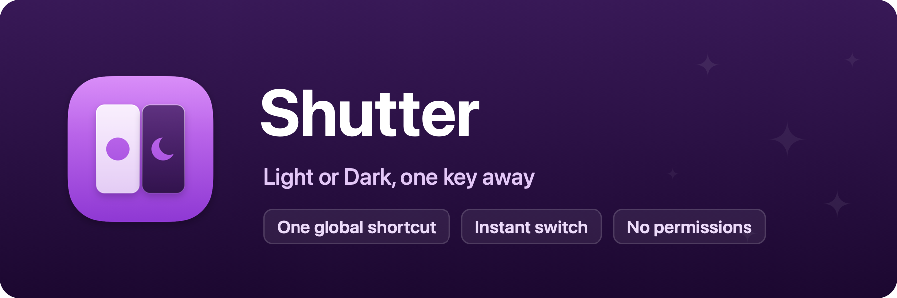

<p align="center">
  
</p>

# Shutter

Toggle Light and Dark Mode with a global shortcut. Part of
[Domus](https://domus-apps.com).

A shutter is the hinged leaf over a window. Swing it open and the room is
daylight, close it and the room is night. Shutter does the same for the Mac:
one keystroke (⌃⌥⌘D out of the box, yours to change) flips the whole system
between Light and Dark Mode, from anywhere. A click on the menu bar icon
does it too.

## How it works

Shutter lands on the same appearance switch System Settings uses, so the
change is instant and animated by the system itself. The shortcut is a plain
Carbon hotkey, no event tap, no Input Monitoring, no Accessibility. The app
asks for no permissions at all.

## Development

```sh
./Scripts/dev.sh      # rebuild-and-relaunch loop
./Scripts/test.sh     # unit tests
./Scripts/bundle.sh   # assemble build/Shutter.app
```

Requires macOS 26 or later.

## License

MIT, see [LICENSE](LICENSE). Bundled third-party software and its licenses are listed in [THIRD-PARTY-NOTICES.md](THIRD-PARTY-NOTICES.md).
